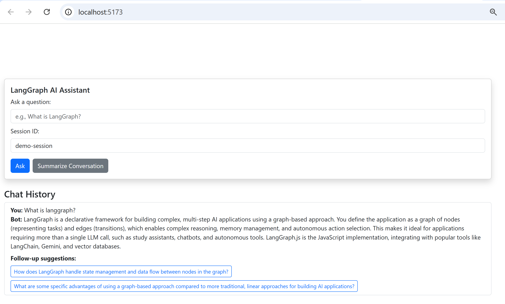

# 🧠 LangGraph.js Agentic RAG App (April 2025 Edition)

This is a full-stack AI assistant application that demonstrates the use of **LangGraph.js**, **Gemini API**, **FAISS vector search**, and **React Vite Bootstrap UI** to build a simple yet agentic Retrieval-Augmented Generation (RAG) app.

## 🚀 Features

---

## 🖼️ Sample UI



---


- ✅ Graph-based state orchestration with LangGraph.js
- ✅ Contextual retrieval using FAISS + semantic embedding (Gemini)
- ✅ Persistent multi-turn memory using SQLite
- ✅ Follow-up question generation (Gemini)
- ✅ Optional conversation summarization
- ✅ Clean React UI with follow-up buttons and summarization toggle

---

## 🗂 Project Structure

```
├── backend-langgraphjs/
│   ├── basicGraph.js       # LangGraph state graph
│   ├── server.js           # Express.js server API
│   ├── data/docs.txt       # Source documents to embed
│   └── vector-index/       # FAISS vector store index (auto generated)
├── frontend-react/
│   └── App.jsx             # React Vite frontend
```

---

## 🧠 LangGraph Overview

This app uses LangGraph.js to construct the following graph-based workflow:

```
[START]
   ↓
[retrieve] → Get relevant chunks from FAISS
   ↓
[generate] → Use Gemini to respond using context + memory
   ↓
[suggest] → Suggest follow-up questions (Gemini)
   ↓
[summarize] → Auto-summary if triggered
   ↓
[END]
```

Each node takes in a shared `state` and contributes part of the logic.

---

## 📦 Setup Instructions

### 1. Backend

```bash
cd backend-langgraphjs
npm install
touch .env
# Add: GEMINI_API_KEY=your_google_key_here
npm run dev
```

### 2. Frontend

```bash
cd agentic-frontend
npm install
npm run dev
```

---

## 💡 Sample Code: Node Definition

```js
async function generate(state) {
  const { question, sessionId, context } = state;
  const history = await getChatHistory(sessionId);
  const prompt = `Context:\n${context}\n\n${historyText}\n\nQ: ${question}`;
  const answer = await invokeGemini(prompt, "generate");
  await saveToMemory(sessionId, question, answer);
  return { answer };
}
```

---

## 🧪 Best Practices (April 2025)

| Design Choice     | Why It’s Good |
|-------------------|---------------|
| ✅ LangGraph.js    | Modular, maintainable, agent-like behavior |
| ✅ FAISS Vector DB | Fast, persistent, realistic for RAG |
| ✅ Gemini 2.0 Flash | Fast + reliable + rich multi-turn context |
| ✅ React Bootstrap | Quick, clean UI |
| ✅ SQLite for chat | Simple persistence with ordering + timestamps |

---

## ✨ Extension Ideas

- Add reflection node to evaluate and possibly re-query
- Show graph visualization of steps on frontend
- Support feedback (thumbs up/down)
- Integrate Gemini multimodal (image + text)

---
